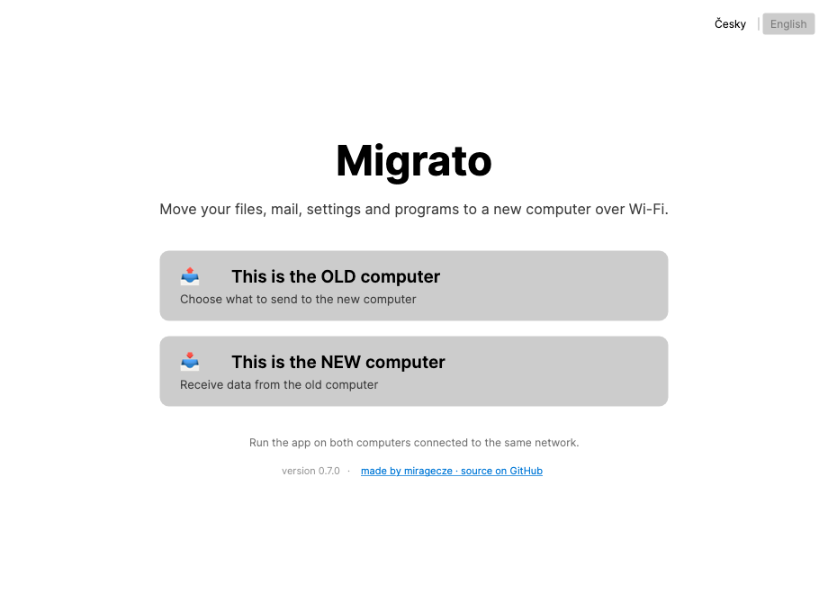
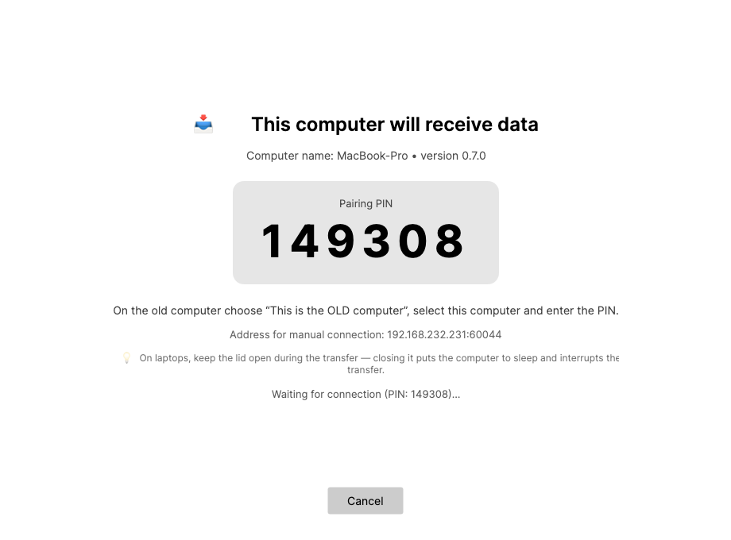

# Migrato

*Čeština: [README.cs.md](README.cs.md)*

An open-source tool for moving your data to a new Windows PC — over Wi-Fi (local network), no cables, no cloud, no fees.

Run the app on both computers, a PIN appears on the new one, pick what to transfer on the old one, done. The UI is in English or Czech, following your Windows language.

| Home | Receiving (new PC) |
|---|---|
|  |  |

## What it transfers

- **Files** — Desktop, Documents, Downloads, Pictures, Music, Videos, Favorites. Folders are resolved via Windows APIs, so OneDrive-redirected folders work too. Plus **any custom folders** from anywhere (including other drives) — they land on the new PC's desktop in “Transferred folders”.
- **Mozilla Thunderbird** — the complete profile: accounts, mail, passwords, contacts, calendar, filters, add-ons.
- **Mozilla Firefox** — the complete profile: bookmarks, passwords, history, extensions, open tabs.
- **Settings of other apps** — Notepad++, VLC, FileZilla, OBS Studio, GIMP, LibreOffice, KeePass, VS Code, Windows Terminal, IrfanView. Missing apps are installed automatically via winget.
- **Chrome and Edge bookmarks** — default profile.
- **Installed programs** — reinstalled automatically on the new PC via `winget import`; a human-readable list of all programs is saved to the desktop.
- **Wi-Fi networks including passwords** — the new computer connects on its own.

## What it deliberately does not promise

Honesty is a core feature of this tool:

- **Chrome and Edge passwords cannot be transferred.** They are encrypted by Windows DPAPI with a key tied to the specific computer and account. Use Google/Microsoft account sync instead. (Firefox and Thunderbird passwords *do* transfer — their key travels with the profile.)
- **Installed programs are not moved 1:1** — they are reinstalled via winget and their data is transferred. Programs not available in winget need manual installation (see the list on your desktop).
- **Hardware-bound licenses** (Office activation, Adobe, etc.) must be transferred with the vendor.

## Quick start (PowerShell)

Paste this into PowerShell on **both** computers — it downloads the latest release and runs it:

```powershell
$dir = "$env:LOCALAPPDATA\Migrato"
New-Item $dir -ItemType Directory -Force | Out-Null
Invoke-WebRequest https://github.com/miragecze/migrato/releases/latest/download/Migrato.exe -OutFile "$dir\Migrato.exe"
Unblock-File "$dir\Migrato.exe"
& "$dir\Migrato.exe"
```

(The app is stored outside the transferred folders on purpose — Migrato excludes the folder it runs from, so don't keep it on the Desktop or in Downloads.)

## How to use it

1. Download `Migrato.exe` from [Releases](../../releases) on **both** computers (or use the PowerShell quick start above). If your browser refuses the exe, grab `Migrato-win-x64.zip` instead and unpack it.
2. On the **new** computer run Migrato and choose **“This is the NEW computer”** — a 6-digit PIN appears.
3. On the **old** computer choose **“This is the OLD computer”** — the new computer shows up in the list (both must be on the same network). If it doesn't (NAT, VMs, separated subnets), use the **manual IP:port connection** shown on the new computer's screen.
4. Enter the PIN, pick what to transfer, start.
5. Close the apps being transferred (Thunderbird, Firefox…) on both computers first — Migrato warns about running processes.

Both computers are kept awake during the transfer. You can still interrupt it at any time — the next run resumes where it left off: finished files are only verified by checksum and skipped, the interrupted file continues from its last byte. Every file is verified with SHA-256 after transfer.

Existing files at the same destination path are overwritten — the tool is designed for migrating to a fresh computer.

> **SmartScreen note:** the exe is not code-signed yet, so Windows shows an “unknown publisher” warning on first run. Click *More info → Run anyway*. Code signing is planned once the project matures.

## Security

- All transfer traffic is TLS-encrypted (an ephemeral certificate per session).
- Pairing is protected by the PIN: the sender proves knowledge of the PIN with an HMAC bound to the receiver's certificate fingerprint, so the PIN is never revealed and a man-in-the-middle fails even with a recorded exchange. The receiver locks the session after 5 failed attempts.
- Data never leaves your local network. No cloud, no telemetry.

## Building from source

Requires the [.NET SDK 10](https://dotnet.microsoft.com/download).

```bash
dotnet test                                  # core tests
dotnet run --project src/Migrato.App        # run for development
dotnet publish src/Migrato.App -c Release -r win-x64 --self-contained \
  -p:PublishSingleFile=true -p:IncludeNativeLibrariesForSelfExtract=true -o publish
```

Development works on macOS/Linux too (Avalonia UI); Windows-only modules (winget, netsh, registry) disable themselves elsewhere.

## Architecture

```
src/Migrato.Core   library: discovery (UDP broadcast), TLS + PIN pairing,
                   transfer protocol with resume and SHA-256 verification,
                   migration modules (known folders, app profiles, winget, Wi-Fi)
src/Migrato.App    GUI (Avalonia, MVVM), Czech/English
tests/             unit tests + an integration loopback transfer over real TCP/TLS
```

Supporting another app = one new entry in `src/Migrato.Core/Modules/app-profiles.json` (where the app keeps its data, process name, winget id) — no new code.

## License

[MIT](LICENSE)
